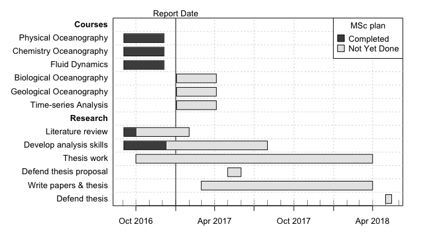

Each `plan` function is documented, with code examples being provided in many
cases.  For example, `help("plot,gantt-method")` provides documentation on
plotting gantt diagrams, and `example("plot,gantt-method")` runs some examples.

There is also a brief vignette, available with `vignette("plan")`.

**Burndown Chart Example**

(To be added.)

**Gantt Diagram Example**

A complex (and realistic) example of a gantt chart for a MSc program that is
still underway. Note that the method of generating the data is one of three
available; other choices are `as.gantt()` and `read.gantt()`.

<!-- png("gantt.png",width=7,height=4,unit="in",res=100,pointsize=10) -->


library("plan")
g <- new("gantt")
g <- ganttAddTask(g, "Courses") # no times, so a heading
g <- ganttAddTask(g, "Physical Oceanography (A)", "2016-09-03", "2016-12-05", done=100)
g <- ganttAddTask(g, "Chemistry Oceanography (B)", "2016-09-03", "2016-12-05", done=100)
g <- ganttAddTask(g, "Fluid Dynamics (A+)", "2016-09-03", "2016-12-05", done=100)
g <- ganttAddTask(g, "Biological Oceanography", "2017-01-03", "2017-04-05")
g <- ganttAddTask(g, "Geological Oceanography", "2017-01-03", "2017-04-05")
g <- ganttAddTask(g, "Time-series Analysis", "2017-01-03", "2017-04-05")
g <- ganttAddTask(g, "Research") # no times, so a heading
g <- ganttAddTask(g, "Literature review", "2016-09-03", "2017-02-01", done=20)
g <- ganttAddTask(g, "Develop analysis skills", "2016-09-03", "2017-08-01", done=30)
g <- ganttAddTask(g, "Thesis work", "2016-10-01", "2018-07-15", done=30)
g <- ganttAddTask(g, "Thesis proposal", "2017-05-01", "2017-06-01")
g <- ganttAddTask(g, "Writing (papers & thesis)", "2017-03-01", "2018-07-15")
g <- ganttAddTask(g, "Defend thesis", "2018-09-01", "2018-09-05")
plot(g, ylabel=list(font=ifelse(is.na(g[["start"]]), 2, 1)),
     event.time="2016-12-13", event.label="Report Date")
par(lend="square") # default is round
legend("topright", pch=22, pt.cex=2, pt.bg=gray(c(0.3, 0.9)),
       border="black", 
       legend=c("Completed", "Not Yet Done"), title="MSc plan", bg="white")


This yields a diagram like the one given below.

Imagine that this diagram is a student's end-of-term assessment. How might her
advisory committee (and she) interpret it?

To begin with, she has done well in her classes, so we should not worry about
the upcoming classes, and can focus instead on the research component.

The vertical line indicates the time the diagram was made.  Visual comparison
of this line with the colour breaks in the task bars indicates three things.
(a) The literature review is a quite far behind schedule. (b) She is picking up
the analysis skills as planned, which bodes well. (c) Even better, her thesis
work is well ahead of schedule.

The next big task is to write and defend a thesis proposal. There is some time
for that, and the diagram indicates that some of that time should be set aside
for reading the literature, because that will be important to both the proposal
and the thesis.  (Also, the thesis work is coming along nicely.)

It should be obvious that this sort of reasoning will be pointless if the
diagram does not faithfully describe the tasks and the time they might take.
But that's the whole point of these diagrams. It is common to create them not
just for planning, but also for monitoring progress.
