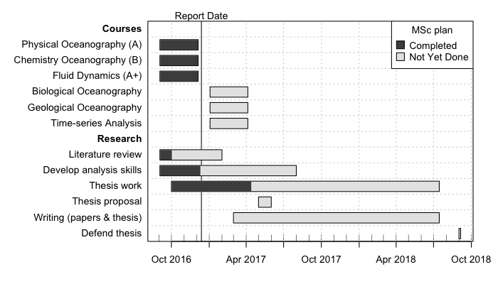

Each `plan` function is documented, with code examples being provided in many
cases.  For example, `help("plot,gantt-method")` provides documentation on
plotting gantt diagrams, and `example("plot,gantt-method")` runs some examples.

There is also a brief vignette, available with `vignette("plan")`.

A good way to learn is to use the built-in datasets, e.g. `data("gantt")`.

A complex (and realistic) example of a gantt chart for a MSc program that is
still underway. Note that the method of generating the data is one of three
available; other choices are `as.gantt()` and `read.gantt()`.

```R
library("plan")
g <- new("gantt")
g <- ganttAddTask(g, "Courses") # no times, so a heading
g <- ganttAddTask(g, "Physical Oceanography", "2016-09-03", "2016-12-05", done=100)
g <- ganttAddTask(g, "Chemistry Oceanography", "2016-09-03", "2016-12-05", done=100)
g <- ganttAddTask(g, "Fluid Dynamics", "2016-09-03", "2016-12-05", done=100)
g <- ganttAddTask(g, "Biological Oceanography", "2017-01-03", "2017-04-05")
g <- ganttAddTask(g, "Geological Oceanography", "2017-01-03", "2017-04-05")
g <- ganttAddTask(g, "Time-series Analysis", "2017-01-03", "2017-04-05")
g <- ganttAddTask(g, "Research") # no times, so a heading
g <- ganttAddTask(g, "Literature review", "2016-09-03", "2017-02-01", done=20)
g <- ganttAddTask(g, "Develop analysis skills", "2016-09-03", "2017-08-01", done=30)
g <- ganttAddTask(g, "Thesis work", "2016-10-01", "2018-04-01", done=30)
g <- ganttAddTask(g, "Defend thesis proposal", "2017-05-01", "2017-06-01")
g <- ganttAddTask(g, "Write papers & thesis", "2017-03-01", "2018-04-01")
g <- ganttAddTask(g, "Defend thesis", "2018-05-01", "2018-05-15")
font <- ifelse(is.na(g[["start"]]), 2, 1)
plot(g, ylabel=list(font=font),
     event.time="2016-12-13", event.label="Report Date")
par(lend="square") # default is round
legend("topright", pch=22, pt.cex=2, pt.bg=gray(c(0.3, 0.9)),
       border="black", 
       legend=c("Completed", "Not Yet Done"), title="MSc plan", bg="white")
```

Comparison of the colours of the task components with the vertical line
suggests that this student is lagging a bit on her literature review, but
on-track with the development of analysis tools, and doing very well on her
planned thesis research.



